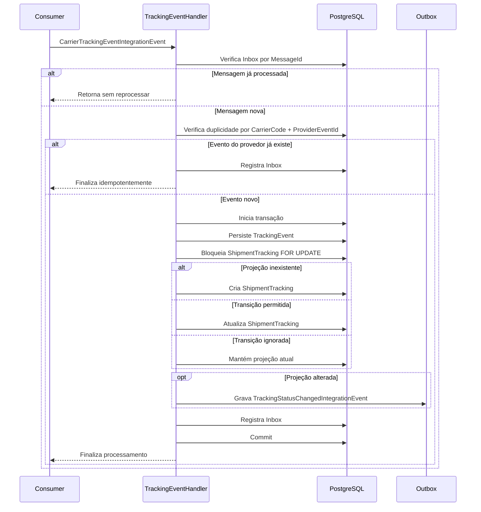

# TrackingService

Microserviço de rastreamento de entregas desenvolvido em **.NET 8**, com persistência em **PostgreSQL** via **Entity Framework Core**, APIs HTTP minimalistas, processamento assíncrono de eventos de transportadoras e publicação de eventos de integração usando os padrões **Inbox** e **Outbox**.

> Esta documentação está em português do Brasil (pt-BR) e descreve a estrutura atual deste repositório.

## Sumário

- [Visão geral](#visão-geral)
- [Principais responsabilidades](#principais-responsabilidades)
- [Tecnologias e dependências](#tecnologias-e-dependências)
- [Arquitetura](#arquitetura)
- [Estrutura do repositório](#estrutura-do-repositório)
- [Modelo de domínio](#modelo-de-domínio)
- [Fluxo de processamento de eventos](#fluxo-de-processamento-de-eventos)
- [APIs HTTP](#apis-http)
- [Contratos de integração](#contratos-de-integração)
- [Persistência e schema lógico](#persistência-e-schema-lógico)
- [Configuração](#configuração)
- [Como executar localmente](#como-executar-localmente)
- [Build, testes e qualidade](#build-testes-e-qualidade)
- [Observabilidade e saúde](#observabilidade-e-saúde)
- [Mensageria, Inbox e Outbox](#mensageria-inbox-e-outbox)
- [Regras de negócio](#regras-de-negócio)
- [Troubleshooting](#troubleshooting)
- [Roadmap técnico sugerido](#roadmap-técnico-sugerido)

## Visão geral

O **TrackingService** mantém a visão atual e o histórico de rastreamento de uma remessa (`ShipmentTracking`) a partir de eventos recebidos de transportadoras (`CarrierTrackingEventIntegrationEvent`).

O serviço:

1. Consome eventos externos de rastreamento.
2. Garante idempotência por mensagem e por evento do provedor.
3. Persiste o histórico completo de eventos de rastreamento.
4. Atualiza uma projeção consultável com o estado atual da remessa.
5. Publica eventos internos quando o status de rastreamento muda.
6. Expõe endpoints HTTP para consultar o rastreamento atual e o histórico de eventos.

## Principais responsabilidades

- **Consulta de rastreamento atual** por `shipmentId` ou `trackingCode`.
- **Consulta paginada de eventos** de rastreamento por remessa.
- **Normalização de transportadora** (`CarrierCode`) para caixa alta.
- **Controle de transições de status** para evitar regressões inválidas.
- **Tratamento idempotente** de mensagens já processadas.
- **Controle de concorrência** ao atualizar a projeção de rastreamento da remessa.
- **Publicação assíncrona** de eventos de alteração de status via Outbox.

## Tecnologias e dependências

- **.NET 8** (`net8.0`)
- **ASP.NET Core Minimal APIs**
- **Entity Framework Core 8**
- **Npgsql Entity Framework Core Provider** para PostgreSQL
- **Health Checks** com verificação do `DbContext`
- **Swagger/OpenAPI** em ambiente de desenvolvimento
- **BackgroundService** para consumidores e dispatchers assíncronos

Dependências NuGet principais:

| Pacote | Finalidade |
| --- | --- |
| `Microsoft.EntityFrameworkCore` | ORM e abstrações de persistência |
| `Microsoft.EntityFrameworkCore.Design` | Suporte a ferramentas de design/migrations do EF Core |
| `Npgsql.EntityFrameworkCore.PostgreSQL` | Provider PostgreSQL para EF Core |
| `Microsoft.Extensions.Diagnostics.HealthChecks.EntityFrameworkCore` | Health check do banco via EF Core |
| `Swashbuckle.AspNetCore` | Swagger/OpenAPI |

## Arquitetura

A solução segue uma separação simples por camadas:

```text
TrackingService
├── Api/                    # Endpoints HTTP
├── Application/            # Casos de uso, políticas e portas
│   └── Ports/              # Interfaces de saída da aplicação
├── Contracts/              # DTOs e contratos de integração/resposta
├── Domain/                 # Entidades, value objects e enumerações
└── Infrastructure/         # Persistência, mensageria e Outbox
    ├── Messaging/
    ├── Outbox/
    └── Persistence/
```

### Camadas

#### `Domain`

Contém as regras e estruturas centrais do negócio:

- `ShipmentTracking`: projeção do estado atual da remessa.
- `TrackingEvent`: evento histórico recebido da transportadora.
- `TrackingLocation`: localização associada ao evento ou à projeção atual.
- `TrackingStatus`: enumeração dos status possíveis de rastreamento.

#### `Application`

Contém orquestração e regras de aplicação:

- `TrackingEventHandler`: processa eventos recebidos, aplica idempotência, atualiza projeção e grava Outbox.
- `TrackingStatusTransitionPolicy`: decide se um evento pode atualizar a projeção atual.
- `ITrackingRepository`: contrato para consulta de rastreamento.
- `IOutboxWriter`: contrato para gravação de mensagens na Outbox.

#### `Infrastructure`

Contém detalhes técnicos:

- `TrackingDbContext`: mapeamento EF Core.
- `TrackingRepository`: implementação de consulta.
- `InboxMessage`: registro de mensagens processadas.
- `OutboxMessage`, `OutboxWriter`, `OutboxDispatcher`: padrão Outbox.
- `ITrackingMessageConsumer`, `KafkaTrackingMessageConsumer`: abstração e implementação atual do consumidor de eventos.
- `IIntegrationEventBus`, `KafkaIntegrationEventBus`: abstração e implementação atual de publicação.

> Observação: as classes `KafkaTrackingMessageConsumer` e `KafkaIntegrationEventBus` usam `Confluent.Kafka` para consumir e publicar eventos reais, mantendo as abstrações para desenvolvimento local e testes end-to-end.

#### `Api`

Expõe endpoints HTTP de leitura para rastreamento e eventos.

## Estrutura do repositório

```text
.
├── Api/
│   └── TrackingEndpoints.cs
├── Application/
│   ├── Ports/
│   │   ├── IOutboxWriter.cs
│   │   └── ITrackingRepository.cs
│   ├── TrackingEventHandler.cs
│   └── TrackingStatusTransitionPolicy.cs
├── Contracts/
│   ├── CarrierTrackingEvent.cs
│   ├── IntegrationEvents.cs
│   └── TrackingResponses.cs
├── Domain/
│   ├── ShipmentTracking.cs
│   ├── TrackingEvent.cs
│   ├── TrackingLocation.cs
│   └── TrackingStatus.cs
├── Infrastructure/
│   ├── Messaging/
│   │   ├── IIntegrationEventBus.cs
│   │   ├── ITrackingMessageConsumer.cs
│   │   ├── KafkaIntegrationEventBus.cs
│   │   ├── KafkaTrackingMessageConsumer.cs
│   │   └── TrackingConsumerWorker.cs
│   ├── Outbox/
│   │   ├── OutboxDispatcher.cs
│   │   ├── OutboxMessage.cs
│   │   └── OutboxWriter.cs
│   └── Persistence/
│       ├── InboxMessage.cs
│       ├── TrackingDbContext.cs
│       └── TrackingRepository.cs
├── Program.cs
├── TrackingService.csproj
├── TrackingService.sln
├── appsettings.json
├── appsettings.Development.json
└── TrackingService.http
```

## Modelo de domínio

### `TrackingStatus`

Status suportados:

| Valor | Status | Descrição sugerida |
| ---: | --- | --- |
| 1 | `Created` | Rastreamento criado |
| 2 | `LabelGenerated` | Etiqueta gerada |
| 3 | `ReadyForPickup` | Pronto para coleta |
| 4 | `PickedUp` | Coletado pela transportadora |
| 5 | `InTransit` | Em trânsito |
| 6 | `AtDistributionCenter` | Em centro de distribuição |
| 7 | `OutForDelivery` | Saiu para entrega |
| 8 | `DeliveryAttempted` | Tentativa de entrega realizada |
| 9 | `Delivered` | Entregue |
| 10 | `Exception` | Exceção operacional |
| 11 | `Cancelled` | Cancelado |
| 12 | `Returned` | Devolvido |

### `TrackingEvent`

Representa o evento individual recebido da transportadora.

Campos principais:

| Campo | Tipo | Obrigatório | Observação |
| --- | --- | --- | --- |
| `Id` | `Guid` | Sim | Gerado no domínio |
| `ShipmentId` | `Guid` | Sim | Identificador interno da remessa |
| `ProviderEventId` | `string` | Sim | Identificador do evento no provedor/transportadora |
| `TrackingCode` | `string` | Sim | Código de rastreio |
| `CarrierCode` | `string` | Sim | Normalizado para caixa alta |
| `CarrierSequence` | `long?` | Não | Sequência enviada pela transportadora, quando existir |
| `Status` | `TrackingStatus` | Sim | Novo status informado |
| `Description` | `string?` | Não | Descrição textual do evento |
| `ExceptionCode` | `string?` | Não | Código de exceção, quando status for excepcional |
| `Location` | `TrackingLocation?` | Não | Local do evento |
| `OccurredAt` | `DateTimeOffset` | Sim | Data/hora em que o evento ocorreu |
| `ReceivedAt` | `DateTimeOffset` | Sim | Data/hora em que o evento foi recebido |
| `EstimatedDeliveryDate` | `DateOnly?` | Não | Previsão de entrega |

### `ShipmentTracking`

Representa a projeção consultável do estado atual da remessa.

Campos principais:

| Campo | Tipo | Observação |
| --- | --- | --- |
| `ShipmentId` | `Guid` | Chave primária |
| `TrackingCode` | `string` | Código de rastreio, único |
| `CarrierCode` | `string` | Código da transportadora |
| `CurrentStatus` | `TrackingStatus` | Status atual |
| `LastEventId` | `Guid` | Último evento aplicado na projeção |
| `LastCarrierSequence` | `long?` | Última sequência aplicada |
| `LastEventOccurredAt` | `DateTimeOffset` | Data/hora do último evento aplicado |
| `LastEventReceivedAt` | `DateTimeOffset` | Data/hora de recebimento do último evento aplicado |
| `LastLocation` | `TrackingLocation?` | Última localização conhecida |
| `EstimatedDeliveryDate` | `DateOnly?` | Previsão de entrega mais recente |
| `DeliveredAt` | `DateTimeOffset?` | Preenchido quando status é `Delivered` |
| `CurrentExceptionCode` | `string?` | Preenchido quando status é `Exception` |
| `Version` | `long` | Token de concorrência |
| `CreatedAt` | `DateTimeOffset` | Criação da projeção |
| `UpdatedAt` | `DateTimeOffset` | Última atualização da projeção |

## Fluxo de processamento de eventos

O processamento principal acontece em `TrackingEventHandler.HandleAsync`.



### Idempotência

Há duas proteções:

1. **Por mensagem**: `InboxMessage` registra `MessageId` já processado.
2. **Por evento do provedor**: índice único lógico por `CarrierCode + ProviderEventId` em `tracking_events`.

### Concorrência

A projeção `shipment_tracking` é carregada com `SELECT ... FOR UPDATE`, evitando que dois eventos da mesma remessa atualizem a projeção simultaneamente de forma inconsistente.

## APIs HTTP

Base path dos endpoints de rastreamento:

```text
/tracking
```

### `GET /tracking/shipments/{shipmentId}`

Consulta a projeção atual pelo identificador interno da remessa.

#### Parâmetros

| Nome | Local | Tipo | Obrigatório | Descrição |
| --- | --- | --- | --- | --- |
| `shipmentId` | path | `Guid` | Sim | Identificador da remessa |

#### Respostas

| Status | Descrição |
| --- | --- |
| `200 OK` | Rastreamento encontrado |
| `404 Not Found` | Remessa não encontrada |

#### Exemplo de requisição

```bash
curl http://localhost:5200/tracking/shipments/11111111-1111-1111-1111-111111111111
```

#### Exemplo de resposta

```json
{
  "shipmentId": "11111111-1111-1111-1111-111111111111",
  "trackingCode": "BR123456789",
  "carrierCode": "CORREIOS",
  "currentStatus": "InTransit",
  "lastLocation": {
    "facilityCode": "CDD-SP-01",
    "city": "São Paulo",
    "state": "SP",
    "country": "BR"
  },
  "lastEventOccurredAt": "2026-06-10T10:15:00+00:00",
  "estimatedDeliveryDate": "2026-06-12",
  "deliveredAt": null,
  "currentExceptionCode": null
}
```

### `GET /tracking/{trackingCode}`

Consulta a projeção atual pelo código de rastreio.

#### Parâmetros

| Nome | Local | Tipo | Obrigatório | Descrição |
| --- | --- | --- | --- | --- |
| `trackingCode` | path | `string` | Sim | Código de rastreio |

#### Respostas

| Status | Descrição |
| --- | --- |
| `200 OK` | Rastreamento encontrado |
| `404 Not Found` | Código de rastreio não encontrado |

#### Exemplo

```bash
curl http://localhost:5200/tracking/BR123456789
```

### `GET /tracking/shipments/{shipmentId}/events`

Consulta o histórico de eventos da remessa, ordenado por `OccurredAt` decrescente e depois por `ReceivedAt` decrescente.

#### Parâmetros

| Nome | Local | Tipo | Obrigatório | Padrão | Descrição |
| --- | --- | --- | --- | --- | --- |
| `shipmentId` | path | `Guid` | Sim | - | Identificador da remessa |
| `limit` | query | `int?` | Não | `50` | Quantidade de eventos retornados. Mínimo `1`, máximo `100` |
| `before` | query | `DateTimeOffset?` | Não | `null` | Retorna apenas eventos com `OccurredAt` anterior ao valor informado |

#### Respostas

| Status | Descrição |
| --- | --- |
| `200 OK` | Lista de eventos. Pode ser vazia |

#### Exemplo

```bash
curl "http://localhost:5200/tracking/shipments/11111111-1111-1111-1111-111111111111/events?limit=20&before=2026-06-10T12:00:00Z"
```

#### Exemplo de resposta

```json
[
  {
    "eventId": "22222222-2222-2222-2222-222222222222",
    "status": "InTransit",
    "description": "Objeto em trânsito",
    "exceptionCode": null,
    "location": {
      "facilityCode": "CDD-SP-01",
      "city": "São Paulo",
      "state": "SP",
      "country": "BR"
    },
    "occurredAt": "2026-06-10T10:15:00+00:00",
    "receivedAt": "2026-06-10T10:16:00+00:00"
  }
]
```

## Contratos de integração

### Evento recebido: `CarrierTrackingEventIntegrationEvent`

Contrato usado para representar um evento recebido da transportadora.

```json
{
  "messageId": "33333333-3333-3333-3333-333333333333",
  "providerEventId": "provider-event-123",
  "shipmentId": "11111111-1111-1111-1111-111111111111",
  "trackingCode": "BR123456789",
  "carrierCode": "correios",
  "carrierSequence": 10,
  "status": "InTransit",
  "description": "Objeto em trânsito",
  "exceptionCode": null,
  "location": {
    "facilityCode": "CDD-SP-01",
    "city": "São Paulo",
    "state": "SP",
    "country": "BR"
  },
  "occurredAt": "2026-06-10T10:15:00+00:00",
  "receivedAt": "2026-06-10T10:16:00+00:00",
  "estimatedDeliveryDate": "2026-06-12"
}
```

### Evento publicado: `TrackingStatusChangedIntegrationEvent`

Quando a projeção é criada ou atualizada por uma transição válida, o serviço grava uma mensagem na Outbox com tópico:

```text
tracking.events
```

Payload lógico:

```json
{
  "messageId": "44444444-4444-4444-4444-444444444444",
  "shipmentId": "11111111-1111-1111-1111-111111111111",
  "trackingCode": "BR123456789",
  "carrierCode": "CORREIOS",
  "previousStatus": "Created",
  "currentStatus": "InTransit",
  "location": {
    "facilityCode": "CDD-SP-01",
    "city": "São Paulo",
    "state": "SP",
    "country": "BR"
  },
  "occurredAt": "2026-06-10T10:15:00+00:00",
  "estimatedDeliveryDate": "2026-06-12",
  "exceptionCode": null
}
```

## Persistência e schema lógico

O serviço utiliza PostgreSQL via EF Core. A string de conexão padrão fica em `ConnectionStrings:TrackingDb`.

### Tabelas mapeadas

| Tabela | Entidade | Finalidade |
| --- | --- | --- |
| `tracking_events` | `TrackingEvent` | Histórico completo de eventos recebidos |
| `shipment_tracking` | `ShipmentTracking` | Projeção atual por remessa |
| `inbox_messages` | `InboxMessage` | Idempotência de mensagens consumidas |
| `outbox_messages` | `OutboxMessage` | Mensagens pendentes/publicadas para integração |

### Índices e restrições relevantes

| Tabela | Índice/restrição | Objetivo |
| --- | --- | --- |
| `tracking_events` | único em `carrier_code + provider_event_id` | Evitar duplicidade de evento do provedor |
| `tracking_events` | índice em `shipment_id + occurred_at` | Otimizar consulta de histórico por remessa |
| `shipment_tracking` | único em `tracking_code` | Permitir consulta direta por código de rastreio |
| `outbox_messages` | índice em `processed_at + next_attempt_at + created_at` | Otimizar polling da Outbox |
| `shipment_tracking.version` | token de concorrência | Apoiar controle de concorrência pelo EF Core |

## Configuração

### `appsettings.json`

Configuração padrão atual:

```json
{
  "ConnectionStrings": {
    "TrackingDb": "Host=localhost;Port=5432;Database=tracking;Username=tracking;Password=tracking"
  },
  "Logging": {
    "LogLevel": {
      "Default": "Information",
      "Microsoft.AspNetCore": "Warning"
    }
  },
  "AllowedHosts": "*"
}
```

### Variáveis de ambiente úteis

| Variável | Exemplo | Descrição |
| --- | --- | --- |
| `ASPNETCORE_ENVIRONMENT` | `Development` | Define o ambiente da aplicação |
| `ASPNETCORE_URLS` | `http://localhost:5200` | URLs em que o serviço escuta |
| `ConnectionStrings__TrackingDb` | `Host=localhost;Port=5432;Database=tracking;Username=tracking;Password=tracking` | Sobrescreve a conexão do PostgreSQL |
| `Logging__LogLevel__Default` | `Information` | Ajusta nível de log padrão |

> Em variáveis de ambiente, use `__` (dois underscores) para separar seções de configuração do .NET.

## Como executar localmente

### Pré-requisitos

- .NET 8 SDK instalado.
- PostgreSQL acessível.
- Banco de dados `tracking` criado, ou string de conexão apontando para outro banco existente.

### 1. Restaurar dependências

```bash
dotnet restore TrackingService.sln
```

### 2. Configurar PostgreSQL

Opção com variável de ambiente:

```bash
export ConnectionStrings__TrackingDb="Host=localhost;Port=5432;Database=tracking;Username=tracking;Password=tracking"
```

Ou edite `appsettings.Development.json` localmente, se preferir.

### 3. Criar/aplicar migrations

Este repositório não contém uma pasta de migrations no estado atual. Para criar uma migration inicial:

```bash
dotnet ef migrations add InitialCreate --project TrackingService.csproj --startup-project TrackingService.csproj
```

Para aplicar migrations:

```bash
dotnet ef database update --project TrackingService.csproj --startup-project TrackingService.csproj
```

> Se `dotnet ef` não estiver instalado, instale a ferramenta com `dotnet tool install --global dotnet-ef` ou use o manifesto de ferramentas da sua organização.

### 4. Executar a aplicação

```bash
dotnet run --project TrackingService.csproj
```

Se desejar fixar a porta:

```bash
ASPNETCORE_URLS=http://localhost:5200 dotnet run --project TrackingService.csproj
```

### 5. Acessar Swagger em desenvolvimento

Com `ASPNETCORE_ENVIRONMENT=Development`, acesse:

```text
http://localhost:5200/swagger
```

### 6. Verificar saúde

```bash
curl http://localhost:5200/health
```

## Build, testes e qualidade

### Build

```bash
dotnet build TrackingService.sln
```

### Build em Release

```bash
dotnet build TrackingService.sln -c Release
```

### Testes

No estado atual, o repositório não possui projetos de teste versionados. Quando testes forem adicionados, execute:

```bash
dotnet test TrackingService.sln
```

### Formatação

```bash
dotnet format TrackingService.sln
```

## Observabilidade e saúde

### Health check

O serviço registra health checks e expõe:

```text
GET /health
```

O health check inclui uma verificação do `TrackingDbContext`, validando a capacidade de conexão/uso do banco configurado.

### Logs

Os logs seguem a configuração padrão do ASP.NET Core. Alguns pontos de log relevantes:

- `KafkaTrackingMessageConsumer`: consumo real de Kafka, commits e nacks.
- `TrackingConsumerWorker`: erro ao processar evento de rastreamento.
- `KafkaIntegrationEventBus`: publicação real de eventos no Kafka.
- `OutboxDispatcher`: falhas ao publicar mensagens da Outbox.

## Mensageria, Inbox e Outbox

### Consumidor de eventos

`TrackingConsumerWorker` é um `BackgroundService` que consome mensagens de `ITrackingMessageConsumer`.

Fluxo:

1. Recebe `ConsumedTrackingMessage`.
2. Cria um escopo DI.
3. Resolve `TrackingEventHandler`.
4. Processa o evento.
5. Executa `CommitAsync` em caso de sucesso.
6. Executa `NackAsync` em caso de exceção.

### Integração Kafka

A classe `KafkaTrackingMessageConsumer` consome Kafka de verdade via `Confluent.Kafka`, assina o tópico `shipment.created` e confirma offsets apenas após o processamento pelo `TrackingConsumerWorker`.

Para produção, é necessário implementar:

- Configurações de bootstrap servers.
- Consumer group.
- Desserialização da mensagem para `CarrierTrackingEventIntegrationEvent`.
- Política de retry/nack/DLQ.
- Commit manual de offsets após sucesso transacional.

### Outbox

O padrão Outbox é usado para evitar perda de eventos publicados quando a atualização do banco e a publicação externa precisam ser coordenadas.

- `OutboxWriter` serializa a mensagem e grava em `outbox_messages` dentro da mesma unidade de trabalho do processamento.
- `OutboxDispatcher` roda a cada 5 segundos.
- O dispatcher busca até 50 mensagens pendentes por ciclo.
- Em sucesso, marca `ProcessedAt`.
- Em falha, incrementa `Attempts` e agenda nova tentativa com backoff exponencial limitado a 300 segundos.

## Regras de negócio

### Eventos terminais

Quando a remessa está em um status terminal, novos eventos não atualizam a projeção:

- `Delivered`
- `Cancelled`
- `Returned`

O histórico do evento ainda pode ser persistido se ele for novo, mas a projeção atual não é alterada.

### Ordenação de eventos

A decisão de aplicar um evento segue esta ordem:

1. Se o evento atual e o evento recebido possuem `CarrierSequence`, a sequência recebida precisa ser maior que a última aplicada.
2. Caso contrário, `OccurredAt` do evento recebido não pode ser anterior ao último evento aplicado.
3. A transição de status precisa ser permitida pela política.

### Transições permitidas

| Status atual | Próximos status permitidos |
| --- | --- |
| `Created` | `LabelGenerated`, `ReadyForPickup`, `PickedUp`, `Cancelled` |
| `LabelGenerated` | `ReadyForPickup`, `PickedUp`, `Cancelled` |
| `ReadyForPickup` | `PickedUp`, `Cancelled`, `Exception` |
| `PickedUp` | `InTransit`, `AtDistributionCenter`, `Exception` |
| `InTransit` | `AtDistributionCenter`, `OutForDelivery`, `DeliveryAttempted`, `Delivered`, `Exception`, `Returned` |
| `AtDistributionCenter` | `InTransit`, `OutForDelivery`, `Exception`, `Returned` |
| `OutForDelivery` | `Delivered`, `DeliveryAttempted`, `Exception` |
| `DeliveryAttempted` | `OutForDelivery`, `InTransit`, `Delivered`, `Exception`, `Returned` |
| `Exception` | `InTransit`, `AtDistributionCenter`, `OutForDelivery`, `DeliveryAttempted`, `Delivered`, `Cancelled`, `Returned` |

Além disso, repetir o mesmo status é permitido, desde que passe pelas regras de sequência/data.

## Troubleshooting

### `NpgsqlException` ou erro de conexão com PostgreSQL

Verifique:

- Se o PostgreSQL está em execução.
- Se `ConnectionStrings__TrackingDb` ou `appsettings.json` apontam para host, porta, banco, usuário e senha corretos.
- Se o banco existe.
- Se migrations foram aplicadas.

### `relation "shipment_tracking" does not exist`

Indica que o schema ainda não foi criado. Gere/aplique migrations do EF Core ou provisione as tabelas manualmente conforme o mapeamento de `TrackingDbContext`.

### Swagger não aparece

Swagger é habilitado apenas em ambiente de desenvolvimento. Configure:

```bash
export ASPNETCORE_ENVIRONMENT=Development
```

Depois execute novamente a aplicação.

### Eventos não são consumidos de Kafka

Verifique se o broker está exposto em `localhost:9092`, se o tópico `shipment.created` existe e se o grupo `tracking-service` aparece no Kafka UI.

### Outbox não publica para broker real

`KafkaIntegrationEventBus` publica no Kafka de verdade; se não houver mensagens em `shipment.status.updated`, verifique os logs do `OutboxDispatcher`, a conectividade com o broker e registros pendentes em `outbox_messages`.

## Roadmap técnico sugerido

- Adicionar migrations EF Core versionadas.
- Adicionar testes unitários para `TrackingStatusTransitionPolicy`.
- Adicionar testes de integração para `TrackingEventHandler` com banco real ou Testcontainers.
- Atualizar `TrackingService.http` com exemplos reais dos endpoints `/tracking`.
- Adicionar Dockerfile e `docker-compose` com PostgreSQL e Kafka para desenvolvimento local.
- Configurar CI com restore, build, test e format check.
- Adicionar autenticação/autorização nos endpoints, se necessário para o contexto do produto.

## Licença

A licença do projeto ainda não está definida neste repositório. Adicione um arquivo `LICENSE` e atualize esta seção conforme a política da organização.

## Integração Kafka local

Este serviço usa `Confluent.Kafka` para integração real com o broker Kafka da solução Meli Envios, mantendo as abstrações existentes (`ITrackingMessageConsumer`, `IIntegrationEventBus`, `TrackingConsumerWorker` e `OutboxDispatcher`).

### Configuração

A configuração padrão para execução local está em `appsettings.json` e `appsettings.Development.json`:

```json
{
  "Kafka": {
    "BootstrapServers": "localhost:9092",
    "ConsumerGroupId": "tracking-service",
    "Topics": {
      "ShipmentCreated": "shipment.created",
      "ShipmentStatusUpdated": "shipment.status.updated"
    }
  }
}
```

> Use `localhost:9092` como broker para microservices rodando fora do Docker. A Kafka UI em `http://localhost:8088` é apenas a interface de inspeção e não deve ser usada como broker.

### Eventos Kafka suportados

- Consumo: `shipment.created`.
- Publicação via Outbox: `shipment.status.updated`.

As mensagens usam o envelope canônico:

```json
{
  "eventId": "00000000-0000-0000-0000-000000000000",
  "eventType": "shipment.created",
  "schemaVersion": "1.0",
  "occurredAt": "2026-06-14T12:00:00Z",
  "correlationId": "local-e2e-001",
  "producer": "shipment-service",
  "payload": {}
}
```

### Teste end-to-end local

1. Suba a infraestrutura do repositório de arquitetura, garantindo que o broker esteja exposto em `localhost:9092` e a Kafka UI em `http://localhost:8088`.
2. Restaure e compile o serviço:

```bash
dotnet restore
dotnet build
dotnet test
```

3. Execute o serviço:

```bash
dotnet run --project TrackingService.csproj
```

4. Publique um evento `shipment.created` no tópico `shipment.created` com key igual ao `shipmentId`:

```json
{
  "eventId": "11111111-1111-1111-1111-111111111111",
  "eventType": "shipment.created",
  "schemaVersion": "1.0",
  "occurredAt": "2026-06-14T12:00:00Z",
  "correlationId": "local-e2e-001",
  "producer": "shipment-service",
  "payload": {
    "shipmentId": "22222222-2222-2222-2222-222222222222",
    "trackingCode": "MLB-E2E-TRACKING",
    "carrierCode": "MELI",
    "estimatedDeliveryDate": "2026-06-18",
    "createdAt": "2026-06-14T12:00:00Z"
  }
}
```

5. O consumer cria a projeção inicial de tracking com status `Created`. Quando a projeção é criada ou atualizada, o `OutboxDispatcher` publica `shipment.status.updated` no Kafka.

### Validação no Kafka UI

Abra `http://localhost:8088` e verifique:

- O tópico `shipment.created` contém o evento publicado para o teste.
- O grupo consumidor `tracking-service` avançou offset no tópico `shipment.created`.
- O tópico `shipment.status.updated` recebeu evento com envelope canônico, `eventType` igual a `shipment.status.updated`, key igual ao `shipmentId` e o mesmo `correlationId` do evento consumido.

Os logs do serviço informam `topic`, `message key`, `eventType` e `correlationId` no consumo e na publicação.
